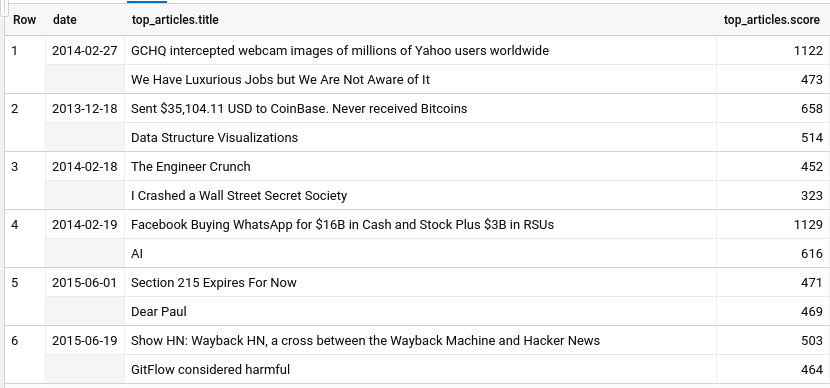

# GCP - Notes

###  Serverless Data Analysis with Google BigQuery and Cloud Dataflow

##### - Advanced Capabilities in BigQuery (video)


* Los arrays en este contexto correponden a una lista ordenada de elementos del mismo tipo.


```sql
WITH
  WashingtonStations AS (
  SELECT
    weather.stn AS station_id,
    ANY_VALUE(station.name) AS name
  FROM
    `bigquery-public-data.noaa_gsod.stations` AS station
  INNER JOIN
    `bigquery-public-data.noaa_gsod.gsod2015` AS weather
  ON
    station.usaf = weather.stn
  WHERE
    station.state = 'WA'
    AND station.usaf != '999999'
  GROUP BY
    station_id)
SELECT
  washington_stations.name,
  (
  SELECT
    COUNT(*)
  FROM
    `bigquery-public-data.noaa_gsod.gsod2015` AS weather
  WHERE
    washington_stations.station_id = weather.stn
    AND prcp > 0
    AND prcp <99 ) AS rainy_days
FROM
  WashingtonStations AS washington_stations
ORDER BY
  rainy_days DESC;
```

* La subquery hace match con el resultado del WITH.

* Podemos organizar los datos de distintas formas (columnar, ortientado a filas etc), pero los enfoques que se utilicen tendrán un impacto en el rendimiento según la consulta. Puede que el método escogido no pueda hacerse de forma paralela.


* Se pueden organizar los datos de distintas formas. Los enfoques tendrán un rendimiento diferente según la consulta. Puede que el método escogido no pueda hacerse de forma paralela.


* La desnormalización requiere más espacio ya que están los datos duplicados, sin embargo, las queries se pueden procesar de una manera más eficaz y en paralelo con el procesamiento por columnas.


##### - Arrays and Structures (video)

* Queremos conseguir top 2 títulos en función del score para la tabla `stories`.

1. Crear array de (`titles`, `scores`)
2. Extraer la fecha de `time_ts`
3. Agrupar por la fecha
* Entonces, la query es:

```sql
SELECT
    ARRAY_AGG(STRUCT(title, score)) AS titles,
    EXTRACT(DATE FROM time_ts) AS date
FROM `bigquery-public-data.hacker_news.stories`
WHERE
    score IS NOT NULL
    AND title IS NOT NULL
GROUP BY date
```
y el resultado correspondiente:


* La query final corresponde a:
```sql
WITH TitlesAndScores AS (
    SELECT
        ARRAY_AGG(STRUCT(title, score)) AS titles,
        EXTRACT(DATE FROM time_ts) AS date
FROM `bigquery-public-data.hacker_news.stories`
WHERE
    score IS NOT NULL
    AND title IS NOT NULL
GROUP BY date)
SELECT date,
    ARRAY(
        SELECT AS STRUCT
            title,
            score FROM
            UNNEST(titles)
        ORDER BY score DESC
        LIMIT 2) AS top_articles
FROM TitlesAndScores;
```

* Donde `ARRAY(SELECT AS STRUCT ...`:
    1. Desarma el array de la cláusula `WITH` utilizando `UNNEST` function.
    2. Los ordena por el `score` tomando los top 2.
    3. Crea un nuevo array con los resultados obtenidos.
* La query externa:
    1. Proyecta la columna `date`.
    2. Proyecta el array.


Resultado correspondiente es:




##### - Join condition and Window Functions (video)


```sql
SELECT
    name,
    SUM(number) AS occurrences
FROM `bigquery-public-data.usa_names.usa_1910_2013`
GROUP BY name
ORDER BY occurrences DESC LIMIT 100
```


```sql
WITH TopNames AS (
    SELECT
        name,
        SUM(number) AS occurrences
    FROM `bigquery-public-data.usa_names.usa_1910_2013`
    GROUP BY name
    ORDER BY occurrences DESC LIMIT 100
)
SELECT name, SUM(word_count) AS frequency
FROM TopNames
JOIN `bigquery-public-data.samples.shakespeare`
ON STARTS_WITH(word, name)
GROUP BY name
ORDER BY frequency DESC
LIMIT 100
```

##### - Performance and Pricing (video)

- El procesamiento en BigQuery es columnar. Entonces al utilizar `SELECT *` se recuperan y procesan todas las columnas. No hacerlo a no ser de que se necesiten en realidad en el procesamiento.
- Menos trabao implica una query más rápida.
- Donde "menos trabajo" conlleva:
    - I/O: Cuántos bytes leíste?
    - Shuffle: Cuántos bytes pasaste a la siguiente etapa?
        - Grouping: Cuántos bytes pasaste entre los grupos?
    - Materialization: Cuántos bytes escribiste?
    - CPU work: UDFs, funciones más costosas que otras. Por ejemplo sin() y cos() vs una suma.
- Filtrar lo antes posible para procesar menos datos en las etapas siguientes.
- Hacer primero los `JOIN` más grandes primero.
- Intentar filtrar antes de hacer el `JOIN`.
- Una cardinalidad baja en los `GROUP BY` es rápida.
    - Una cardinalidad baja es la que tiene pocos datos (grouping). En el ejemplo de los commits durante los fines de semana, una baja cardinalidad corresponde a Haskell, mientras que una alta sería Javascript.
    - Grouping: Cuánta data estoy agregando por key y por agregación?
- Si se tienen muchas claves el problema también será de alta cardinalidad (más grupos) lo que implica que habrá un problema de shuffling (tendrá mucha latencia final).
- Al momento de crear funciones hay que tener en consideración la sobrecarga de CPU que implica esa función. El siguiente lineamiento es de más a menos eficiente:
    - Las funciones integradas (built-in).
    - Construir propias funciones SQL.
    - UDFs en Javascript.
- Considerar las funciones `ÀPROX` de BigQuery. Ya que entregan resultados razonablemente buenos en tiempos mucho menores.
- Primero filtrar y luego ordenar.


##### - Wildcard Tables and Partitioning (video)

- Para llamar a múltiples tablas se pueden utilizar wilcards:

```sql
SELECT *
FROM `bigquery-public-data.noaa_gsod.gsod*`
LIMIT 1000
```
- Table partitioning:


- Para monitorear performance:
    - Por query analizar qué hizo la query utilizando el plan.
    - Monitoreo a nivel de proyecto a través de Google StackDriver.

- Para la siguiente query el plan es como sigue:

```sql
WITH TopNames AS (
    SELECT
        name,
        SUM(number) AS occurrences
    FROM `bigquery-public-data.usa_names.usa_1910_2013`
    GROUP BY name
    ORDER BY occurrences DESC LIMIT 100
)
SELECT name, SUM(word_count) AS frequency
FROM TopNames
JOIN `bigquery-public-data.samples.shakespeare`
ON STARTS_WITH(word, name)
GROUP BY name
ORDER BY frequency DESC
LIMIT 100
```


- Se debe tener en consideración [la intrepretación](https://cloud.google.com/bigquery/query-plan-explanation?hl=es-419)  del plan de ejecución:


- Hay que tener en consideración la desviación de cada etapa.


##### - BigQuery Plans and Categories (video)

- Se deben buscan cualquier etapa que presente una diferencia significativa entre el avg y el max time.
    - Observar la cantidad de tiempo que se gasta esperando en cada etapa.
- Categorías en pricing:
    - Free:
        - Loading
        - Exporting
        - Queries on metadata
        - Cached queries
        - Queries with error
    - Processing:
        - On-demand OR Flat-rate plans
        - On-demand based on amount of data processed
        - 1 TB/Month free
        - Have to opt-in to run high-compute queries.
    - Storage:
        - Amount of data in teble
        - Ingest rate of streaming data
        - Automatic discount for old data
