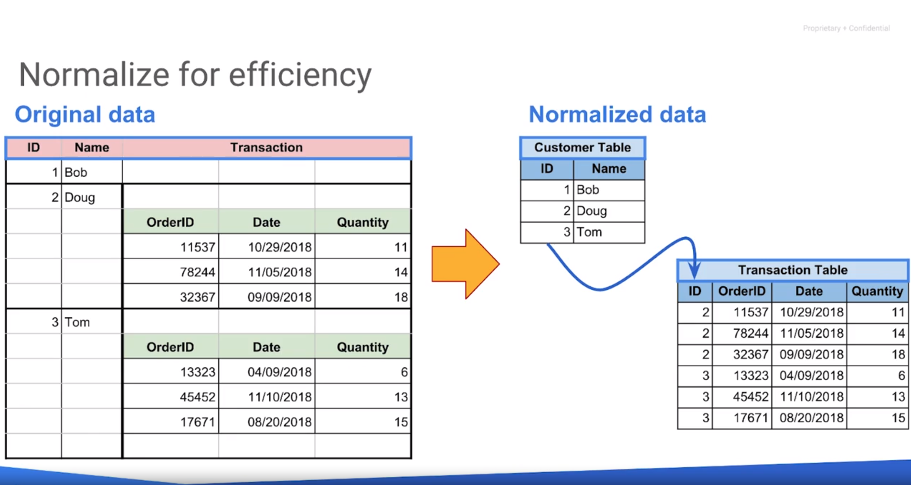

# GCP - Notes

###  Serverless Data Analysis with Google BigQuery and Cloud Dataflow
* Advanced Capabilities in BigQuery (video)


\- Arreglos: Lista ordenada de elementos.


```sql
WITH
  WashingtonStations AS (
  SELECT
    weather.stn AS station_id,
    ANY_VALUE(station.name) AS name
  FROM
    `bigquery-public-data.noaa_gsod.stations` AS station
  INNER JOIN
    `bigquery-public-data.noaa_gsod.gsod2015` AS weather
  ON
    station.usaf = weather.stn
  WHERE
    station.state = 'WA'
    AND station.usaf != '999999'
  GROUP BY
    station_id)
SELECT
  washington_stations.name,
  (
  SELECT
    COUNT(*)
  FROM
    `bigquery-public-data.noaa_gsod.gsod2015` AS weather
  WHERE
    washington_stations.station_id = weather.stn
    AND prcp > 0
    AND prcp <99 ) AS rainy_days
FROM
  WashingtonStations AS washington_stations
ORDER BY
  rainy_days DESC;
```

* La subquery hace match con el resultado del WITH.

Podemos organizar los datos de distintas formas (columnar, ortientado a filas etc), pero los enfoques que se utilicen tendrán un impacto en el rendimiento según la consulta. Puede que el método escogido no pueda hacerse de forma paralela.



* Se pueden organizar los datos de distintas formas. Los enfoques tendrán un rendimiento diferente según la consulta. Puede que el método escogido no pueda hacerse de forma paralela.


* La desnormalización requiere más espacio ya que están los datos duplicados, sin embargo, las queries se pueden procesar de una manera más eficaz y en paralelo con el procesamiento por columnas.


###
