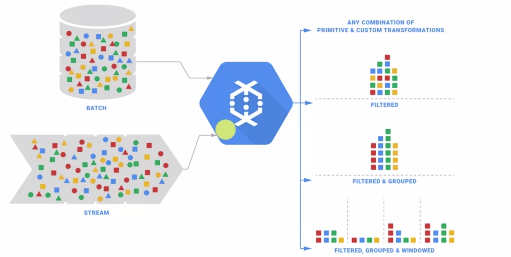
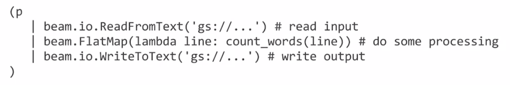
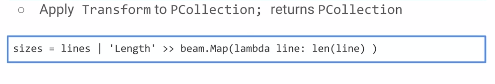
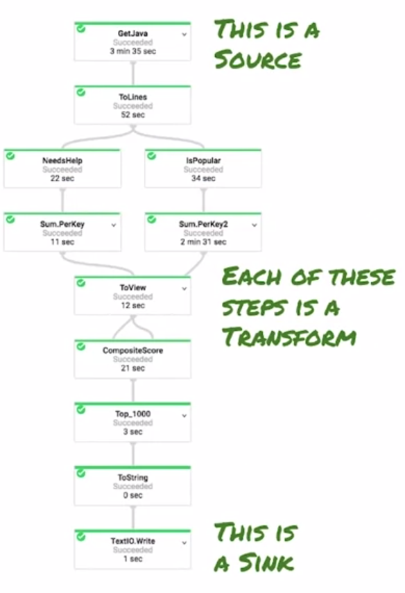
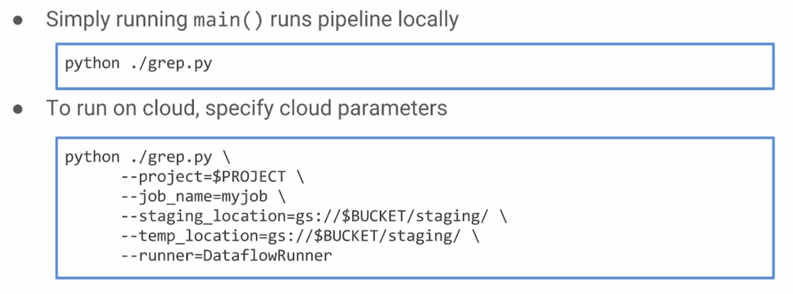

# GCP - Notes

###  Serverless Data Analysis with Google BigQuery and Cloud Dataflow

##### - Autoscaling data processing pipelines (video)

- En dataflow es posible crear pipelines que pueden ejecutarse de igual manera en batch processing y en stream processing.
    - Cuando se trabaja en stram processing, los cálculos son realizados en función de una ventana de datos.

##### - Write Data Pipelines in Java and Python (video)

- Un pipeline es ejecutado cloud por un `runner`.
- Cada `step` es elásticamente escalado.
- Cada `transform` de un pipeline es aplicada sobre un `pcollection` (parallel collection).
    - El resultado de `apply()` es otra `pcollection`
- Se sobreacarga el operador pipe en python para realizar las transformaciones:

- Los datos en un `pipeline` son representados por `PCollection`, es decir, las tranformaciones son aplicadas sobre una `PCollection`:
    - Soporta el procesamiento en paralelo.
    - No es una colección en memoria.
- Una transformación en python:

- Los nombres de las transformaciones serán útiles, entre otras cosas, para visualizar de la siguiente manera el conjunto de transformaciones.

- Las tranformaciones deben tener un nombre único.

##### - Input Output and Run (video)

- Se pueden leer datos de:
    - GCS
    - BigQuery, retorna un `TableRow`
    - Pub/Sub
- Al momento de escribir, los datos serán fragmentados.
    - Si no se quiere fragmentar (pensado en archivos muy pequeños), se puede utilizar `ẁithoutSharding()`
- Se puede escribir en:
    - GCS
    - BigQuery
    - Pub/Sub
- Para ejecutar en python:

