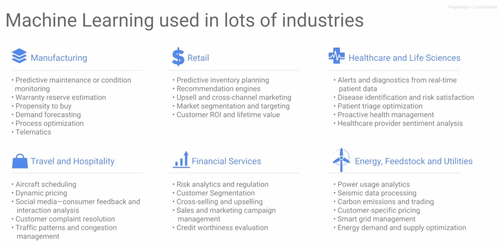
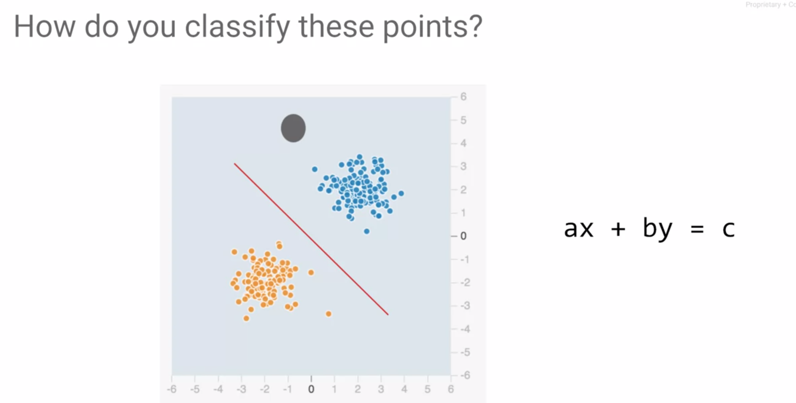
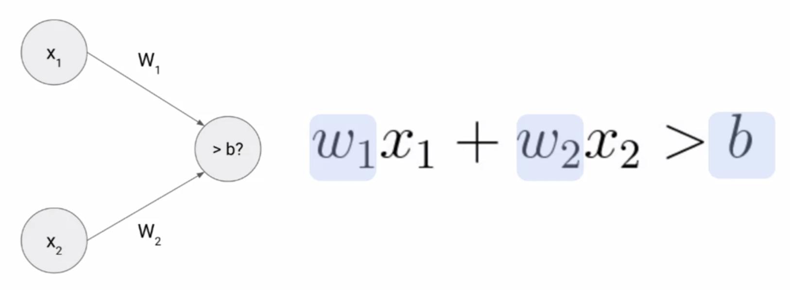

# Serverless ML with TensorFlow on GCP

##### - Framing a ML problem (video)

##### - Framing a ML problem (video)

- Para separar las clases podemos trazar una línea que separe las instancias y decir que todo lo que esté sobre la línea corresponde a una clase, y todo lo que esté debajo corresponde a la otra clase.
- Todos los valores que están arriba de la línea marcan los valores mayores que c y todos los valores que están debajo de la línea marcan los valores menores que c.

- Una neurona es una forma de combinar las entradas y tomar una decisión sobre ellas. 

